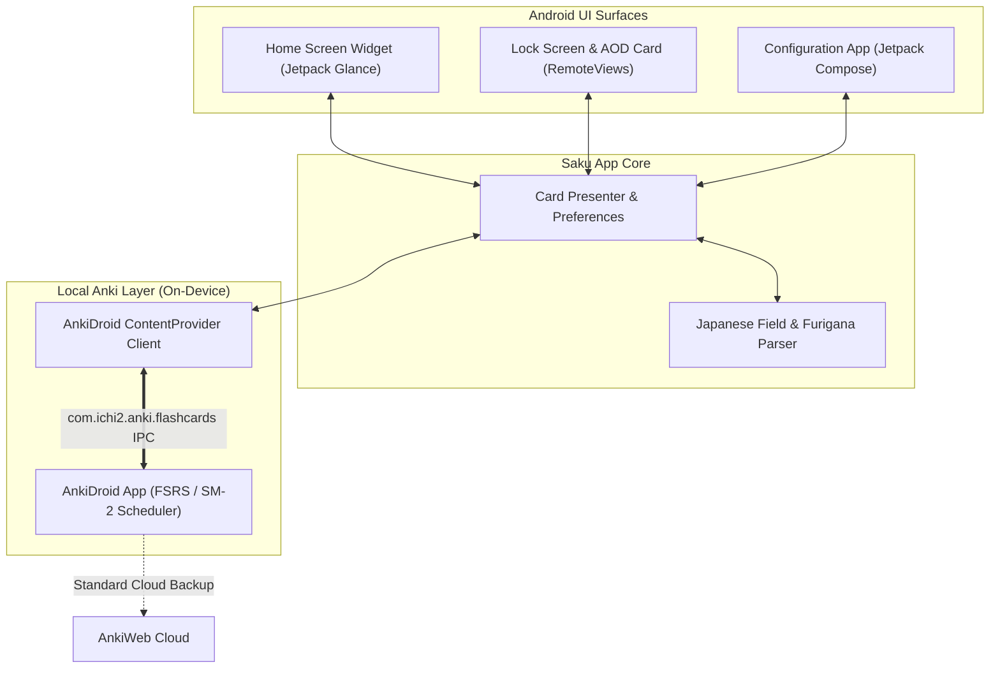

<div align="center">

# 🌸 Saku • 咲く
### Minimal Spaced Repetition Japanese Flashcard Widget for Android

[-3DDC84?style=flat&logo=android&logoColor=white)](https://android.com)
[](https://github.com/LiebeandSkye/saku/releases)
[](https://kotlinlang.org)
[](https://developer.android.com/jetpack/compose)
[-0080FF?style=flat&logo=anki&logoColor=white)](https://github.com/ankidroid/Anki-Android)
[](https://opensource.org/licenses/MIT)

*Passive Japanese immersion directly on your **Home Screen**, **Lock Screen**, and **Always-On Display (AOD)** — seamlessly synced with your **AnkiDroid** decks without losing your FSRS / SM-2 algorithm schedule.*

---

```
┌─────────────────────────────────────────────────────────────┐
│   ┌────┐   ひ  hi                                           │
│   │ 日 │   sun                                              │
│   └────┘   日本  •  Japan                                   │
│                                                             │
│   [ Again ]    [ Hard ]    [ Good (4d) ]    [ Easy (7d) ]   │
└─────────────────────────────────────────────────────────────┘
```

</div>

---

## 🌟 Highlights

* **🔒 Zero Login / 100% On-Device & Private**: No usernames, passwords, or cloud relay servers. Uses Android's native inter-process `ContentProvider` API (`com.ichi2.anki.api`) with a **1-tap permission prompt**.
* **🧠 Preserves Your Algorithm (FSRS & SM-2)**: Reviews made on the widget are submitted directly into AnkiDroid. Your intervals, stability, retention factors, and AnkiWeb cloud sync stay 100% accurate and intact.
* **📱 Lock Screen & Always-On Display (AOD)**: Optimized for **OxygenOS (OnePlus)** and modern Android devices. Pinned high-contrast card right under the lock screen clock without needing to unlock your phone.
* **⚡ Interactive Home Screen Widget**: Built with **Jetpack Glance** (Compose for AppWidgets). Flip cards, advance cards, or submit ratings (*Again*, *Hard*, *Good*, *Easy*) directly from your home screen.
* **🔋 Ultra Lightweight & Offline**:
  * APK size: **~6 MB**
  * Memory: **< 25 MB RAM** (drops to 0 when idle)
  * Battery: **< 0.1% / day** (zero background polling loops)
  * **100% Offline**: Works in airplane mode or subway with zero internet required.

---

## 📥 Download & Install

### Option 1: Download Pre-built APK (Direct Download)
1. Go to the [**Releases**](https://github.com/LiebeandSkye/saku/releases) page.
2. Download **`Saku.apk`** directly onto your phone.
3. Tap the downloaded file and select **Install** *(if prompted by Google Play Protect, tap "More details" $\rightarrow$ "Install anyway")*.

### Option 2: 5-Second First-Time Setup
1. Open **Saku** on your phone.
2. Tap **"Connect to AnkiDroid (1-Tap)"** $\rightarrow$ tap **Allow**.
3. Pick your Japanese deck (e.g. *Kaishi 1.5k*, *Core 2k/6k*, *Tango N5/N4*, or *Wanikani*).
4. **Home Screen Widget**: Long-press your home screen $\rightarrow$ tap **Widgets** $\rightarrow$ add **Saku**.
5. **Lock Screen / AOD**: Toggle **"Lock Screen & AOD Display"** ON in the app $\rightarrow$ lock your phone to enjoy!

---

## 🏗️ Architecture & How It Works



### 1. Zero-Friction Inter-Process Communication (IPC)
Saku communicates with AnkiDroid through Android's secure `ContentProvider`:
```kotlin
// Queries due cards directly from AnkiDroid's local SQLite database
val cursor = context.contentResolver.query(
    AnkiDroidContract.Cards.CONTENT_URI,
    arrayOf("_id", "nid", "did", "ivl", "due"),
    "did = ?",
    arrayOf(deckId.toString()),
    "due ASC LIMIT 30"
)
```

### 2. Live Review Grading
When you press a rating button on the widget, Saku forwards the answer to AnkiDroid, which runs your active algorithm (FSRS weights or SM-2):
```kotlin
val answerUri = Uri.parse("content://com.ichi2.anki.flashcards/cards/$cardId/answer")
val values = ContentValues().apply { put("ease", ease) }
context.contentResolver.update(answerUri, values, null, null)
```

---

## 🛠️ Building from Source

### Prerequisites
* Android Studio (Koala / Ladybug / Meerkat or newer)
* Android SDK (API 35, Min SDK 26)
* JDK 17+

### 1. Clone the repository
```bash
git clone https://github.com/LiebeandSkye/saku.git
cd saku
```

### 2. Build via Command Line
```bash
# Windows
.\gradlew.bat assembleDebug

# macOS / Linux
chmod +x gradlew
./gradlew assembleDebug
```
The compiled APK will be generated at:
`app/build/outputs/apk/debug/app-debug.apk`

---

## 📖 Supported Anki Decks & Note Formats

Saku includes a smart Japanese field and furigana parser (`JapaneseFieldParser.kt`) compatible with virtually all standard Japanese Anki formats:
* **Kaishi 1.5k / 2.3k**
* **Core 2k / 6k / 10k**
* **Tango N5 / N4 / N3 / N2 / N1**
* **Wanikani Anki Decks**
* **Remembering the Kanji (RTK)**
* **Furigana bracket syntax**: Automatically cleans and parses formats like `日本[にほん]` $\rightarrow$ Headword: `日本`, Reading: `にほん`, Romaji: `nihon`.
* **HTML Tags & Audio sound tags**: Automatically strips `<br>`, `<div>`, and `[sound:...]` annotations for a clean minimal widget display.

---

## 🔐 Permissions & Privacy

Saku is built with extreme privacy in mind. It does **NOT** request internet permissions to exfiltrate data:
* `com.ichi2.anki.permission.READ_WRITE_DATABASE`: Used solely to read due cards and record review answers with AnkiDroid locally on your phone.
* `android.permission.POST_NOTIFICATIONS`: Required on Android 13+ to display the minimal card on your Lock Screen and Always-On Display.
* `android.permission.FOREGROUND_SERVICE`: Keeps the Lock Screen card pinned cleanly without being killed by Android battery optimizations.

---

## 🤝 Contributing

Contributions, issues, and feature requests are welcome!
Feel free to check the [issues page](https://github.com/LiebeandSkye/saku/issues) if you want to contribute.

1. Fork the Project
2. Create your Feature Branch (`git checkout -b feature/AmazingFeature`)
3. Commit your Changes (`git commit -m 'Add some AmazingFeature'`)
4. Push to the Branch (`git push origin feature/AmazingFeature`)
5. Open a Pull Request

---

## 📄 License

Distributed under the **MIT License**. See [`LICENSE`](LICENSE) for more information.

---

<div align="center">
Made with ❤️ for Japanese learners.
</div>
